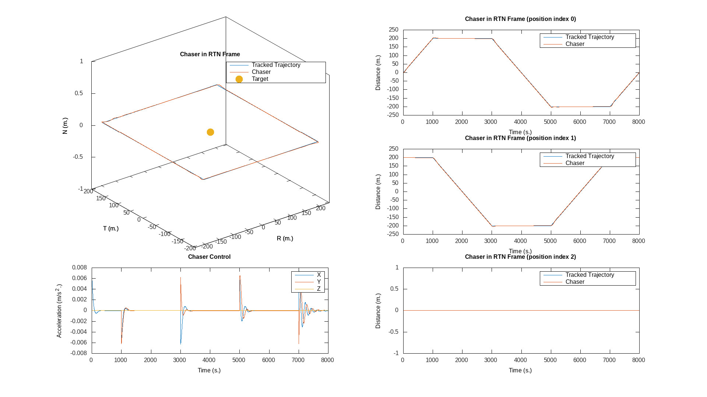

# Rendezvous & Proximity Operations

This respository contains the code for the restricted two-body simulator and
controllers that were implemented for the final project of my ME 601 Autonomous
Feedback course.

The final report can be seen [here](https://github.com/ianruh/Rendezvous-Proximity/blob/master/report/Report.pdf)



*This simulation tracked a box trajectory around the target in a circular orbit
at and SMA of approx 30,000 km*

## Structure

The `proposal/` and `report/` directories contain the documents that were
actually turned in. The `simulator/` directory contains the source code.

There one primary executable `rendezvousMain`, that can be used to run an
visualize a set of different simulations, each of which are defined as a
function in `simulator/src/SimulationRuns.cpp`. Each controller has it's own
source file, and each one inherits from a toplevel `Vehicle` class that
performs the orbit propogation as the simulation runs.

## Building

Eigen3 is the only dependency that won't be dounloaded at configure time. To
build, simply clone and use the provided utility script:

```
$ git clone git@github.com:ianruh/Rendezvous-Proximity.git
$ cd Rendezvous-Proximity/simulator
$ ./utils build
```

## Dependencies

- [cppmpc](https://github.com/ianruh/cppmpc) for the MPC controller
- [SymEngine](https://github.com/symengine/symengine) for the symbolic
  mathematics
- [Eigen3](https://eigen.tuxfamily.org/index.php?title=Main_Page) for linear
  algebra and basic vector/matrix types.
- [Matplot++](https://github.com/alandefreitas/matplotplusplus) for plotting
  and visualization.
